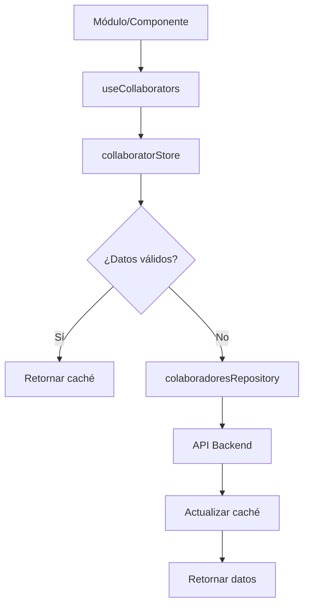

# Patrón de Manejo de Colaboradores

Este documento describe la arquitectura implementada para el manejo centralizado de colaboradores en la aplicación, siguiendo el patrón Repository con caché global.

## 📋 Arquitectura

### 1. **Repository Layer** (`colaboradoresRepository.ts`)
- **Responsabilidad única**: Comunicación con el backend
- **Ubicación**: `/src/repository/colaboradoresRepository.ts`
- **Funciones**:
  - `getColaboradores()` - Obtiene lista de colaboradores
  - `getColaboradorPorCorreo()` - Busca por email
  - Definición de interfaces y tipos

### 2. **Store Global** (`collaboratorStore.ts`)
- **Responsabilidad**: Caché temporal y gestión de estado
- **Ubicación**: `/src/store/collaboratorStore.ts`
- **Características**:
  - Caché con tiempo de vida de **1 hora**
  - Refresh silencioso a los **50 minutos**
  - Estados de loading, error y datos
  - Búsqueda y filtrado local

### 3. **Composable Helper** (`useCollaborators.ts`)
- **Responsabilidad**: Interfaz simplificada para módulos
- **Ubicación**: `/src/shared/composables/useCollaborators.ts`
- **Proporciona**: Hooks especializados y funciones utilitarias

## 🔄 Flujo de Datos



## 🚀 Uso en Módulos

### Inicialización Básica
```typescript
import { useCollaborators } from '@/shared/composables/useCollaborators';

export default {
  setup() {
    const { colaboradores, isLoading, initialize } = useCollaborators();
    
    onMounted(() => {
      initialize(); // Carga automática si es necesario
    });
    
    return { colaboradores, isLoading };
  }
}
```

### Para Selectores/Dropdowns
```typescript
import { useCollaborators } from '@/shared/composables/useCollaborators';

export default {
  setup() {
    const selectedIds = ref([1, 2, 3]);
    
    const { 
      useCollaboratorSelector 
    } = useCollaborators();
    
    const {
      colaboradores,
      search,
      hasData,
      refresh
    } = useCollaboratorSelector(() => selectedIds.value);
    
    return { colaboradores, search, hasData, refresh };
  }
}
```

### Búsqueda Avanzada
```typescript
const { search, findBy, findById } = useCollaborators();

// Búsqueda por texto
const results = search('juan', [1, 2], 10); // query, exclude, limit

// Búsqueda por criterios
const managers = findBy({ cargo: 'gerente' });

// Búsqueda por ID
const colaborador = findById(123);
```

## ⚙️ Configuración del Caché

### Tiempos de Vida
- **Caché válido**: 60 minutos
- **Refresh silencioso**: 50 minutos
- **Verificación automática**: En cada `initialize()`

### Estados del Caché
- `valid` - Datos frescos y válidos
- `expired` - Datos expirados, requiere recarga
- `no-data` - Sin datos cargados

### Métodos de Actualización
```typescript
// Refresh manual (con loading)
await refresh();

// Refresh forzado
await fetch(true);

// Refresh silencioso (sin loading)
await backgroundRefresh();
```

## 🛠️ API del Store

### Estados Reactivos
```typescript
const store = useCollaboratorStore();

// Datos
store.list              // Colaborador[]
store.count             // number
store.isEmpty           // boolean

// Estados
store.isLoading         // boolean
store.hasError          // boolean
store.errorMessage      // string | null

// Caché
store.isDataExpired     // boolean
store.needsBackgroundRefresh // boolean
store.cacheInfo         // { status, message, remainingMs }
```

### Métodos Principales
```typescript
// Inicialización inteligente
await store.initialize();

// Recarga forzada
await store.refresh();

// Búsqueda local
const results = store.search(query, excludeIds);

// Búsqueda por ID
const colaborador = store.findById(123);

// Estadísticas
const stats = store.getStats();
```

## 📱 Integración en Componentes

### ColaboradorSelectionStep.vue (Ejemplo)
```vue
<script setup>
import { useCollaboratorStore } from '@/store/collaboratorStore';

const store = useCollaboratorStore();

// Estados reactivos
const loading = computed(() => store.isLoading);
const error = computed(() => store.errorMessage);

// Búsqueda con exclusiones
const filteredColaboradores = computed(() => {
  const excludeIds = selectedColaboradores.value.map(c => c.user_id);
  return store.search(searchQuery.value, excludeIds);
});

// Inicialización
onMounted(() => {
  store.initialize();
});
</script>
```

## 🔧 Desarrollo y Debug

### Información de Caché (Solo Development)
```vue
<div v-if="process.env.NODE_ENV === 'development'" class="cache-info">
  {{ store.cacheInfo.message }}
  <button @click="store.refresh()">🔄</button>
</div>
```

### Estadísticas del Store
```typescript
const stats = store.getStats();
console.log('Colaboradores:', stats.totalColaboradores);
console.log('Último fetch:', stats.lastFetch);
console.log('Estado caché:', stats.cacheStatus);
```

## ✅ Beneficios

1. **Performance**: Una sola carga inicial, filtrado local
2. **Consistencia**: Única fuente de verdad para todos los módulos
3. **UX**: Refresh silencioso, sin interrupciones
4. **Mantenibilidad**: Separación clara de responsabilidades
5. **Escalabilidad**: Fácil extensión para nuevos módulos

## 🚨 Reglas Importantes

### ❌ NO Hacer
```typescript
// ❌ Llamada directa al repositorio desde módulos
import { getColaboradores } from '@/repository/colaboradoresRepository';
const data = await getColaboradores(centros, planta);
```

### ✅ SÍ Hacer
```typescript
// ✅ Usar el store centralizado
import { useCollaborators } from '@/shared/composables/useCollaborators';
const { colaboradores, initialize } = useCollaborators();
await initialize();
```

## 🔄 Migración de Módulos Existentes

### Pasos para migrar un módulo:
1. Remover importaciones directas del repository
2. Importar `useCollaborators` o `useCollaboratorStore`
3. Reemplazar llamadas a API por métodos del store
4. Usar estados reactivos del store
5. Llamar `initialize()` en `onMounted`

### Ejemplo de migración:
```typescript
// ANTES
import { getColaboradores } from '@/repository/colaboradoresRepository';
const colaboradores = ref([]);
const loading = ref(false);

const loadData = async () => {
  loading.value = true;
  try {
    const data = await getColaboradores(centros, planta);
    colaboradores.value = data.results;
  } finally {
    loading.value = false;
  }
};

// DESPUÉS
import { useCollaborators } from '@/shared/composables/useCollaborators';
const { colaboradores, isLoading, initialize } = useCollaborators();

onMounted(() => initialize());
```

## 📈 Métricas y Monitoreo

El store proporciona métricas útiles para monitoreo:
- Tiempo desde último fetch
- Estado del caché
- Número de colaboradores cargados
- Errores de carga
- Frecuencia de refresh

Estas métricas pueden ser útiles para optimización y debugging en producción.
